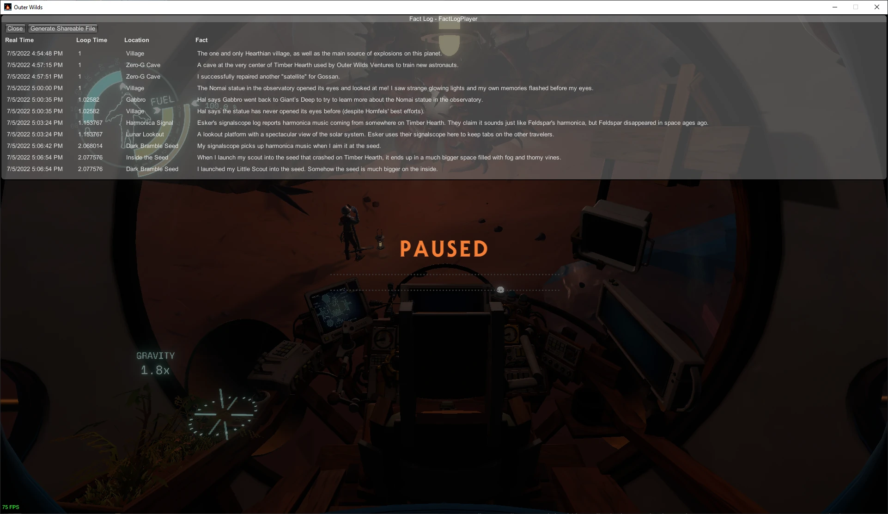

# Outer Wilds Fact Log

Displays a list of all facts (exploration information and rumors) that you have encountered in your current playthrough, and in the order you encountered them.

A new option will be added to your in-game pause menu that allows you to open the fact log. You can also generate an html file containing the log entries that you can view offline or share with other players.

## Known Issues and Limitations

- The dates and times of logged facts will be incorrect if they are added to your ship log before you install the mod or while the mod is disabled. However, the relative order should still be correct.
- Ship log entries added by other mods, such as [New Horizons](https://nh.outerwildsmods.com/) addons, may not be logged correctly.
- The fact log interface does not support controller/gamepad input.

## Contribution

Pull requests are welcome!
